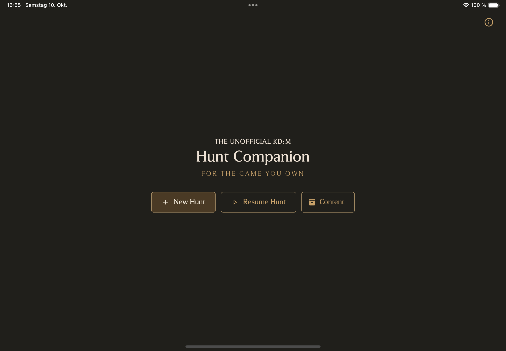
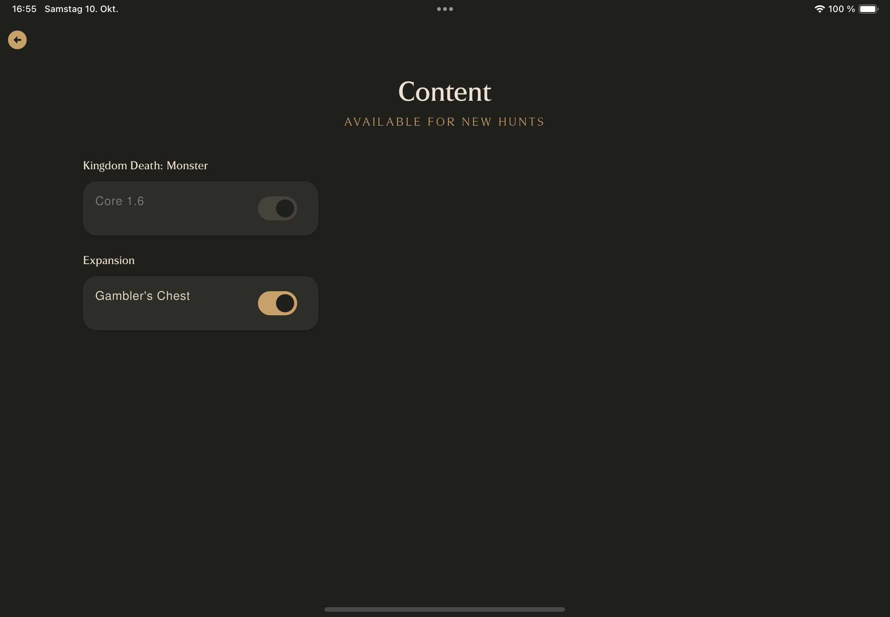
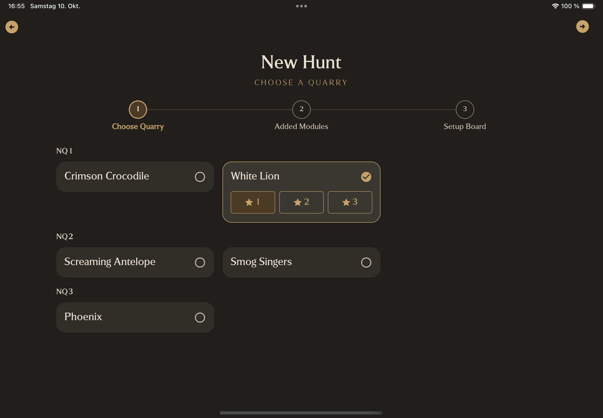
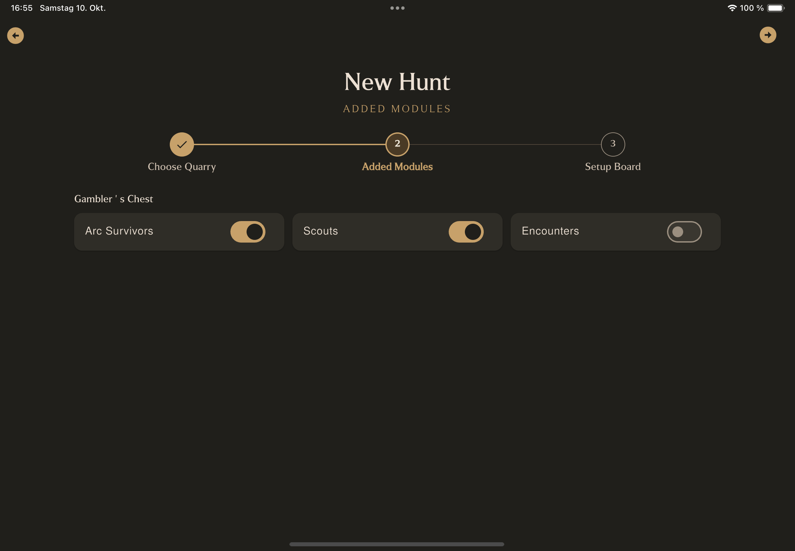
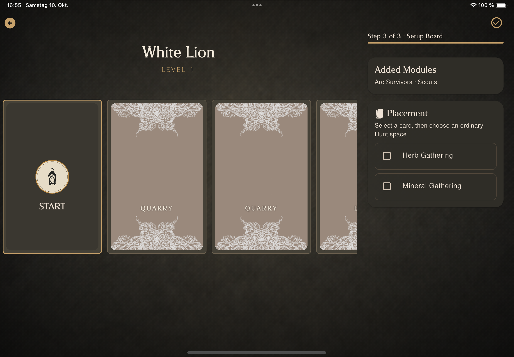
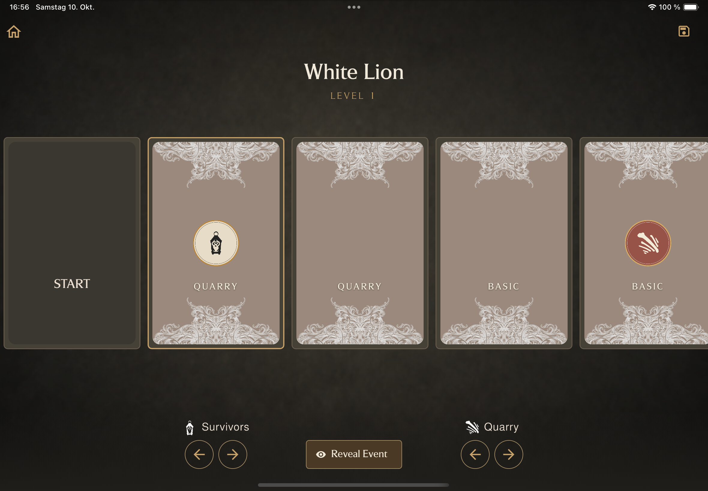
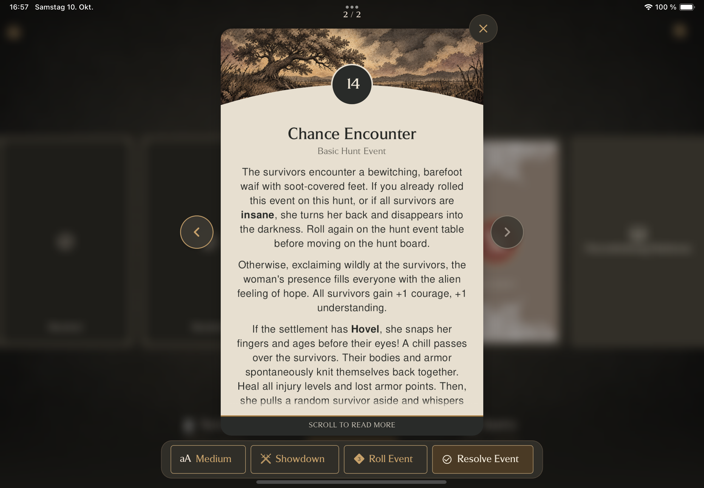
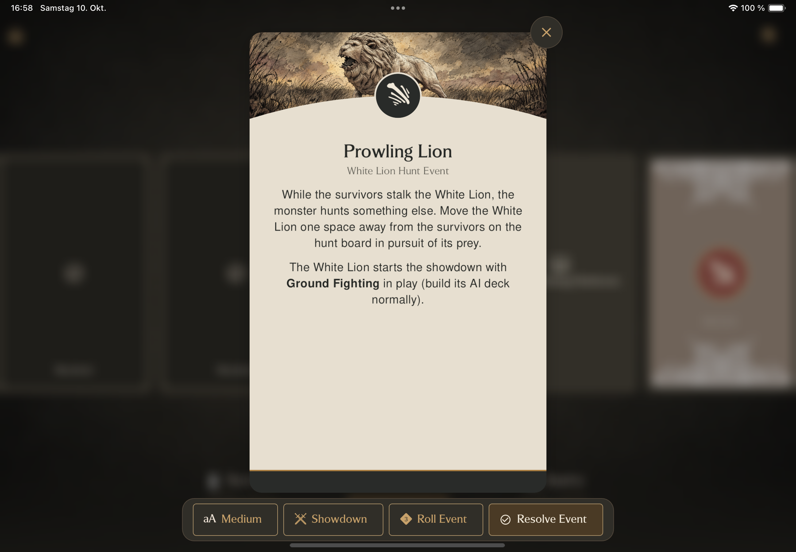
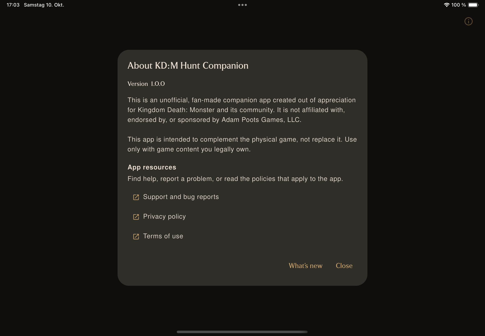

# The Unofficial KD:M Hunt Companion

[Hunt Companion](https://fairbanxde.github.io/hunt-companion-site/) is an unofficial, fan-made companion app for **Kingdom Death: Monster** (KD:M). It helps players prepare and follow a Hunt without replacing the physical game.

Features: choose a Quarry, configure the Hunt, navigate the digital Hunt
Board, resolve Hunt Events, and resume a saved Hunt later.

The app is designed for smartphones and tablets and keeps the table authoritative. Physical cards, dice, miniatures, and player decisions remain part of play. **It is intended to complement the physical game, not replace it.** Use only with game content you legally own.

Hunt Compantion is not affiliated with, endorsed by, or sponsored by Adam Poots Games, LLC.

## App Screenshots

| Start screen | Content | Hunt setup 1 |
| --- | --- | --- |
|  |  |  |

| Hunt setup 2 | Hunt setup 3 | Hunt board |
| --- | --- | --- |
|  |  |  |

| Hunt event detail 1 | Hunt event detail 2 | About |
| --- | --- | --- |
|  |  |  |
